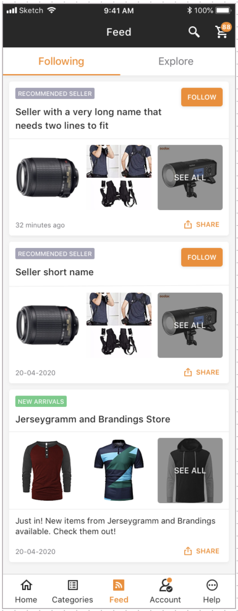

# ptc_ios_test-newsfeed

Jumia Porto Tech Center (PTC) is an Agile IT development center, with around 200 IT-specialists, 
where you will have the opportunity to participate in developing smart solutions for our group companies. 
We do e-commerce shops, logistics, business intelligence and mobile applications involving a wide range of high-end technologies for tens of millions customers.  

You can check our job opportunities at our site: https://group.jumia.com/careers.  

We were founded in 2012 and today we are part of Jumia Group powered by Rocket Internet, Millicom, MTN, Axa Group, 
Goldman Sachs, Orange and CDC.   Working at PTC means being in the first line of e-commerce development in emerging markets.  

What you will find in PTC?  

In PTC you will have an opportunity to develop and apply e-business software solutions for a wide range of business areas. 

You will belong to the international team with the top experts who will inspire and support you in working on an international scale impacting millions of revenue (travelling, logistics, e-shops) and users. 

We are humble and pragmatic. 

We are passionate about what we do, and we have fun while doing it. 

We move in a fast-pace and we are ready to challenge risks. 

We value sharing knowledge and learning from each other. We are flexible and we believe that anything is possible. 

We will offer you second home where you will find the opportunity for growth and career development.
You will have the opportunity to earn the bonus based on your excellent results. 
The benefit list includes but is not limited to health insurance, parental bonus, snacks and fruits.

This repo represents the current admission test that is needed to apply for an iOS Developer Position.

iOS Challenge:
-

Create the news feed screen that is able to list items.

Description:
-

The following requirements need to be met:

The application must display the news feed screen and be able to list items.

Note: API requests are not required, items can be dummy.

The design for newsfeed screen:

Submission:
-
- Create a pull request
- Title format "Challenge Admission Test - FIRST_NAME LAST_NAME"
- Write a description about your implementation

Required tech implementations:
-
- Swift;
- MVVM;
- Clean Architecture;
- No Storyboards and no XIBs;
- AutoLayout with Constraints;
- Human Interface Guidelines;

We value the following implementations:
-
- Material Design Components;
- Publish subscribe;
- View/Data Binding;
- Animations;
- Image Loader;
- API communication;
